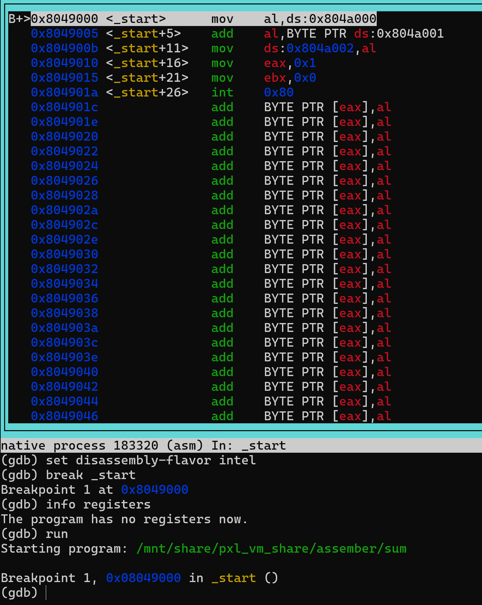

# Assembler

## Introduction

An assembler is a program that translates assembly language code into machine code. The assembler reads the assembly code and translates it into machine code. The machine code is then executed by the computer.

## Assembly Language

Assembly language is a low-level programming language that is used to write programs that are executed by a computer. Assembly language is a human-readable representation of machine code. Each assembly language instruction corresponds to a single machine code instruction.

## Machine Code

Machine code is a low-level programming language that is executed by a computer. Machine code is a binary representation of the instructions that the computer executes. Each machine code instruction corresponds to a single operation that the computer performs.

## Assembler Directives

Assembler directives are special instructions that are used to control the behavior of the assembler. Assembler directives are used to define constants, allocate memory, and control the flow of the program.

## Assembler Instructions

Assembler instructions are the instructions that are translated by the assembler into machine code. Assembler instructions are the basic building blocks of assembly language programs. Assembler instructions are used to perform operations such as arithmetic, logical, and control operations.

## Example - Adding Two Numbers

Here is an example of an assembly language program that adds two numbers:

```assembly
section .data       ' data section (variables)
    num1 db 10      ' define a byte variable num1 with value 10
    num2 db 20      ' define a byte variable num2 with value 20
    sum db 0        ' define a byte variable sum with value 0

section .text       ' code section (instructions)
    global _start   ' entry point of the program

_start:            ' start of the program
    mov al, [num1] ' move the value of num1 into the al register
    add al, [num2] ' add the value of num2 to the al register
    mov [sum], al  ' move the value of the al register into sum

    mov eax, 1     ' exit system call
    mov ebx, 0     ' exit status
    int 0x80       ' call the kernel
```

In this example, the assembly language program adds two numbers `num1` and `num2` and stores the result in `sum`. The program then exits by calling the `exit` system call.

## NASM

NASM is a popular assembler for x86 and x86-64 architectures. NASM is a free and open-source assembler that is widely used for writing assembly language programs.

## GDB

GDB is a powerful debugger for C, C++, and assembly language programs. GDB allows you to inspect the state of a program, set breakpoints, and step through the program one instruction at a time.

layout asm       # TUI view (if available)
si               # step instruction-by-instruction
ni               # next instruction
info registers   # check AL / EAX / etc.
continue         # continue execution
quit             # quit gdb

## Execute the assembly code

✅ 1. 📝 Save the Code (e.g. sum.asm)

```bash
nano sum.asm
```

```assembly
section .data
    num1 db 10
    num2 db 20
    sum db 0

section .text
    global _start

_start:
    mov al, [num1]
    add al, [num2]
    mov [sum], al

    mov eax, 1
    mov ebx, 0
    int 0x80
```

✅ 2. 🛠 Assemble with NASM

```bash
nasm -f elf32 sum.asm -o sum.o
```

-f elf32 = 32-bit format output object file

```bash
file sum.o
```

```output
sum.o: ELF 32-bit LSB relocatable, Intel 80386, version 1 (SYSV), not stripped
```

✅ 3. 🔗 Link with ld (32-bit)

```bash
ld -m elf_i386 sum.o -o sum
```

-m elf_i386 = force 32-bit linking

```bash
file sum
```

```output
sum: ELF 32-bit LSB executable, Intel 80386, version 1 (SYSV), statically linked, not stripped
```

✅ 4. ▶ Run the Executable

```bash
./sum
```

This will just run and exit (you won’t see output), but the sum is stored in memory.

🧪 5. 🧵 View Result in sum (debug)

```bash
gdb ./sum       # start gdb
```

```gdb
set disassembly-flavor intel    # set disassembly flavor
break _start                    # set breakpoint at _start
run                             # run the program
info registers                  # view registers
si                              # step into the program
info registers                  # view registers        
si                              # step into the program
info registers                  # view registers
si                              # step into the program
info registers                  # view registers
si                              # step into the program
info registers                  # view registers
si                              # step into the program
info registers                  # view registers
si                              # step into the program
info registers                  # view registers
quit                            # quit gdb
```

```bash
gdb ./sum
GNU gdb (Debian 15.2-1+b1) 15.2
Copyright (C) 2024 Free Software Foundation, Inc.
License GPLv3+: GNU GPL version 3 or later <http://gnu.org/licenses/gpl.html>
This is free software: you are free to change and redistribute it.
There is NO WARRANTY, to the extent permitted by law.
Type "show copying" and "show warranty" for details.
This GDB was configured as "x86_64-linux-gnu".
Type "show configuration" for configuration details.
For bug reporting instructions, please see:
<https://www.gnu.org/software/gdb/bugs/>.
Find the GDB manual and other documentation resources online at:
    <http://www.gnu.org/software/gdb/documentation/>.

For help, type "help".
Type "apropos word" to search for commands related to "word"...
Reading symbols from ./sum...
(No debugging symbols found in ./sum)
(gdb) set disassembly-flavor intel
(gdb) break _start
Breakpoint 1 at 0x8049000
(gdb) run
Starting program: /mnt/share/pxl_vm_share/assember/sum

Breakpoint 1, 0x08049000 in _start ()
(gdb) info registers
eax            0x0                 0
ecx            0x0                 0
edx            0x0                 0
ebx            0x0                 0
esp            0xffffd3d0          0xffffd3d0
ebp            0x0                 0x0
esi            0x0                 0
edi            0x0                 0
eip            0x8049000           0x8049000 <_start>
eflags         0x202               [ IF ]
cs             0x23                35
ss             0x2b                43
ds             0x2b                43
es             0x2b                43
fs             0x0                 0
gs             0x0                 0
(gdb) si
0x08049005 in _start ()
(gdb) info registers
eax            0xa                 10
ecx            0x0                 0
edx            0x0                 0
ebx            0x0                 0
esp            0xffffd3d0          0xffffd3d0
ebp            0x0                 0x0
esi            0x0                 0
edi            0x0                 0
eip            0x8049005           0x8049005 <_start+5>
eflags         0x202               [ IF ]
cs             0x23                35
ss             0x2b                43
ds             0x2b                43
es             0x2b                43
fs             0x0                 0
gs             0x0                 0
(gdb) si
0x0804900b in _start ()
(gdb) info registers
eax            0x1e                30
ecx            0x0                 0
edx            0x0                 0
ebx            0x0                 0
esp            0xffffd3d0          0xffffd3d0
ebp            0x0                 0x0
esi            0x0                 0
edi            0x0                 0
eip            0x804900b           0x804900b <_start+11>
eflags         0x206               [ PF IF ]
cs             0x23                35
ss             0x2b                43
ds             0x2b                43
es             0x2b                43
fs             0x0                 0
gs             0x0                 0
(gdb) si
0x08049010 in _start ()
(gdb) info registers
eax            0x1e                30
ecx            0x0                 0
edx            0x0                 0
ebx            0x0                 0
esp            0xffffd3d0          0xffffd3d0
ebp            0x0                 0x0
esi            0x0                 0
edi            0x0                 0
eip            0x8049010           0x8049010 <_start+16>
eflags         0x206               [ PF IF ]
cs             0x23                35
ss             0x2b                43
ds             0x2b                43
es             0x2b                43
fs             0x0                 0
gs             0x0                 0
(gdb) si
0x08049015 in _start ()
(gdb) info registers
eax            0x1                 1
ecx            0x0                 0
edx            0x0                 0
ebx            0x0                 0
esp            0xffffd3d0          0xffffd3d0
ebp            0x0                 0x0
esi            0x0                 0
edi            0x0                 0
eip            0x8049015           0x8049015 <_start+21>
eflags         0x206               [ PF IF ]
cs             0x23                35
ss             0x2b                43
ds             0x2b                43
es             0x2b                43
fs             0x0                 0
gs             0x0                 0
(gdb) si
0x0804901a in _start ()
(gdb) info registers
eax            0x1                 1
ecx            0x0                 0
edx            0x0                 0
ebx            0x0                 0
esp            0xffffd3d0          0xffffd3d0
ebp            0x0                 0x0
esi            0x0                 0
edi            0x0                 0
eip            0x804901a           0x804901a <_start+26>
eflags         0x206               [ PF IF ]
cs             0x23                35
ss             0x2b                43
ds             0x2b                43
es             0x2b                43
fs             0x0                 0
gs             0x0                 0
(gdb) si
[Inferior 1 (process 165812) exited normally]
(gdb) quit
```

## 📚 Readelf

```bash
readelf -S ./sum
```

There are 6 section headers, starting at offset 0x20ec:

Section Headers:
  [Nr] Name              Type            Addr     Off    Size   ES Flg Lk Inf Al
  [ 0]                   NULL            00000000 000000 000000 00      0   0  0
  [ 1] .text             PROGBITS        08049000 001000 00001c 00  AX  0   0 16
  [ 2] .data             PROGBITS        0804a000 002000 000003 00  WA  0   0  4
  [ 3] .symtab           SYMTAB          00000000 002004 000090 10      4   5  4
  [ 4] .strtab           STRTAB          00000000 002094 00002f 00      0   0  1
  [ 5] .shstrtab         STRTAB          00000000 0020c3 000027 00      0   0  1
Key to Flags:
  W (write), A (alloc), X (execute), M (merge), S (strings), I (info),
  L (link order), O (extra OS processing required), G (group), T (TLS),
  C (compressed), x (unknown), o (OS specific), E (exclude),
  D (mbind), p (processor specific)

## Execute the assembly code with GDB (Graphical Debugger)

```bash
gdb ./sum
```

```gdb
layout asm
set disassembly-flavor intel
break _start
run
info registers
exit
```



## Example - Hello World

```bash
nano hello.asm
```

```assembly
section .data
    msg db "Hello, world", 10, 0     ; message + newline + null terminator

section .text
    global main                      ; make symbol visible to linker
    extern printf                    ; declare C library function

main:
    push msg                         ; push pointer to message (argument for printf)
    call printf                      ; call printf(msg)
    add esp, 4                       ; clean up the stack

    mov eax, 0                       ; return 0
    ret                              ; return to caller
```

Make object file from assembly code

```bash
 nasm -f elf32 hello.asm -o hello.o
 ```

Link object file with gcc

```bash
gcc -m32 hello.o -o hello
```

```bash
file ./hello
```

```output
./hello: ELF 32-bit LSB pie executable, Intel 80386, version 1 (SYSV), dynamically linked, interpreter /lib/ld-linux.so.2, BuildID[sha1]=4006610d80b2df1f0b99e972f3d9491c92a1c14a, for GNU/Linux 3.2.0, not stripped
```

Run the executable

```bash
./hello
```

```output
Hello, world
```
